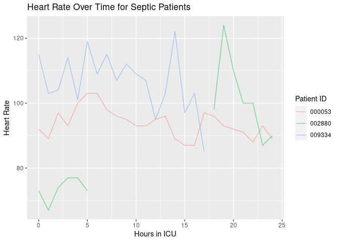
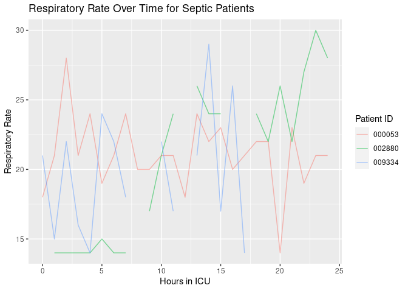
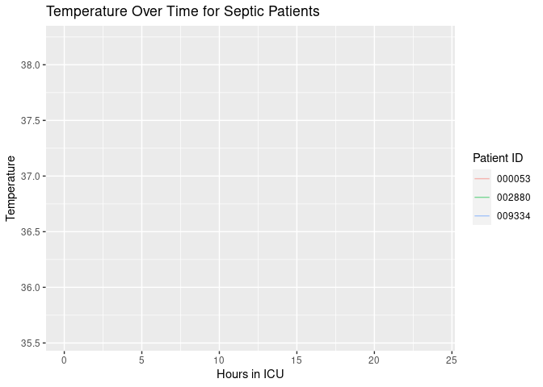

ICU Status Report (7462 HW7)
================
David McGowan

This report was produced at 2023-04-07 16:28:19.

| Patient ID | Heart Rate | Temperature | Respiratory Rate |
|:-----------|-----------:|------------:|-----------------:|
| 000053     |         89 |          NA |               21 |
| 002880     |         90 |          NA |               28 |
| 009334     |         85 |          NA |               14 |

Current Stats of Septic Patients

| PatientID | Temperature change | Heart rate change | Respiratory rate change |
|:----------|-------------------:|------------------:|------------------------:|
| 000044    |                 NA |                12 |                       3 |
| 000053    |                 NA |                -4 |                       0 |
| 000560    |                 NA |                NA |                      NA |
| 000588    |                 NA |                NA |                      NA |
| 000594    |                 NA |                 5 |                      -6 |
| 000750    |                 NA |                -3 |                      -5 |
| 001164    |                 NA |                 0 |                      -7 |
| 001202    |                 NA |                 3 |                      -3 |
| 001593    |                 NA |                 3 |                       2 |
| 001694    |                 NA |                -5 |                      -6 |
| 001874    |                 NA |                -3 |                      -3 |
| 002522    |                 NA |                -2 |                       3 |
| 002652    |                 NA |                -5 |                       3 |
| 002791    |                 NA |                -2 |                      -5 |
| 002820    |                 NA |                 2 |                      -1 |
| 002880    |                 NA |                 3 |                      -2 |
| 003075    |              -0.10 |                -2 |                       1 |
| 003164    |                 NA |                -5 |                      -9 |
| 003271    |                 NA |                 8 |                      -9 |
| 003631    |                 NA |                 1 |                       0 |
| 003780    |                 NA |                -1 |                      -2 |
| 003918    |                 NA |                 7 |                       2 |
| 004665    |                 NA |                22 |                       9 |
| 004673    |                 NA |                -2 |                      -1 |
| 004804    |                 NA |                15 |                       3 |
| 004930    |                 NA |                 4 |                      10 |
| 005001    |                 NA |                 6 |                       1 |
| 005034    |                 NA |                 2 |                       3 |
| 005060    |                 NA |                -1 |                      -3 |
| 005592    |                 NA |                -6 |                       1 |
| 006102    |               0.10 |                 4 |                      -2 |
| 006473    |                 NA |                -2 |                      -1 |
| 006618    |               0.10 |                 1 |                      -5 |
| 006655    |                 NA |               -15 |                      -2 |
| 006797    |              -0.34 |                -7 |                       0 |
| 007079    |                 NA |               -13 |                       3 |
| 007181    |               0.00 |                -4 |                       0 |
| 007371    |                 NA |                NA |                      NA |
| 007479    |                 NA |                34 |                      -3 |
| 007816    |                 NA |                 1 |                      -4 |
| 008029    |                 NA |                 0 |                      -1 |
| 008533    |                 NA |                -5 |                      -8 |
| 008752    |                 NA |                 1 |                       0 |
| 008847    |                 NA |                -6 |                      11 |
| 008867    |                 NA |                23 |                      -3 |
| 009005    |                 NA |                NA |                      NA |
| 009273    |                 NA |                12 |                      11 |
| 009334    |                 NA |               -18 |                     -12 |
| 009667    |                 NA |                 1 |                       5 |
| 009762    |                 NA |                 7 |                       6 |

Patients’ Recent Changes in Vital Stats
